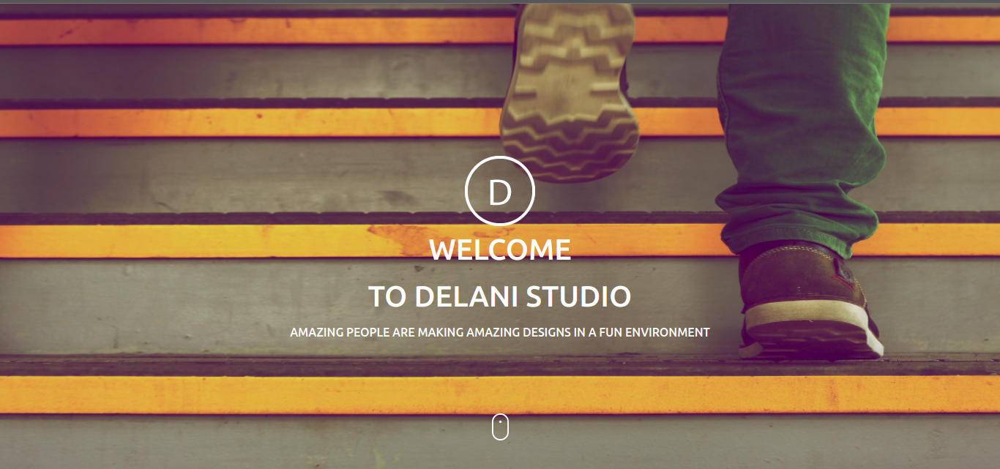

# DELANI STUDIO CLONE

#### A web application clone of Delani Studio,

#### By **Lynn Nyangon**

## Description

A web application clone of Delani Studio that comprises of information about the company, services offered and a detailed description of the each, work/projects done by the company, a contact us form and social media accounts' links for interested parties to reach out to the company. In addition to that, there's form validation and tracking of messages sent by interested parties via the contact us form, using Mailchimp.

## Setup/Installation Requirements

- Using a mobile device/laptop ensure you have access to internet connection.
- To get the web application's code in your GitHub repository, you can fork the repository via the 'Fork' button in the main page of the master branch.
- To get the web application's code on your laptop/computer, navigate to the 'Code' button in the main page of master branch to download the ZIP file or get the link to clone the repoistory.
- Once on the laptop/computer, you can view or edit the code using a text editor or Integrated Development Environment(IDE).
- For installation of current versions of dependencies; Bootstrap or JQuery, you can replace the already included Bootstrap or jQuery with the current versions.
- For integration with Mailchimp update the link in the form action attribute, with the one you'll be provided with in your Mailchimp account.
- Otherwise, to view the web application navigate to the link below  
https://annal001.github.io/delani-studio-clone/

## Dependencies

- Bootstrap - CSS Framework with predefined styles to speed up development time.
- jQuery - JavaScript library that allows for DOM Manipulation with less boilerplate code.
- Mailchimp - Track user's email and messages 

## Technologies Used

- HTML - For structuring of webpages
- CSS - For custom styling of webpage elements
- JavaScript - For defining User Interface behaviour.

## Support and contact details

In case of any queries, you can reach me via email; lynn.nyangon@gmail.com

### License

Permission is hereby granted, free of charge, to any person obtaining a copy
of this software and associated documentation files (the "Software"), to deal
in the Software without restriction, including without limitation the rights
to use, copy, modify, merge, publish, distribute, sublicense, and/or sell
copies of the Software, and to permit persons to whom the Software is
furnished to do so, subject to the following conditions:

The above copyright notice and this permission notice shall be included in all
copies or substantial portions of the Software.

THE SOFTWARE IS PROVIDED "AS IS", WITHOUT WARRANTY OF ANY KIND, EXPRESS OR
IMPLIED, INCLUDING BUT NOT LIMITED TO THE WARRANTIES OF MERCHANTABILITY,
FITNESS FOR A PARTICULAR PURPOSE AND NONINFRINGEMENT. IN NO EVENT SHALL THE
AUTHORS OR COPYRIGHT HOLDERS BE LIABLE FOR ANY CLAIM, DAMAGES OR OTHER
LIABILITY, WHETHER IN AN ACTION OF CONTRACT, TORT OR OTHERWISE, ARISING FROM,
OUT OF OR IN CONNECTION WITH THE SOFTWARE OR THE USE OR OTHER DEALINGS IN THE
SOFTWARE. 
Copyright (c) 2022 **Lynn Nyangon**
